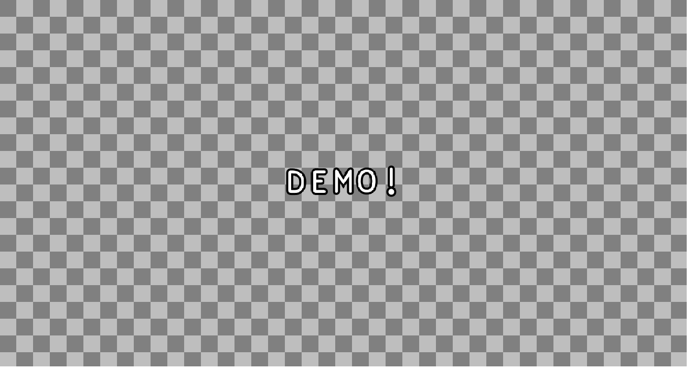

# Kaboom.js demo

This is a simple demo using the [Kaboom.js](https://kaboomjs.com/) game engine.

"Kaboom is a Javascript game programming library that helps you make games fast and fun."



## Installation

```bash
git clone https://github.com/kgish/kaboomjs-demo.git
cd kaboomjs-demo
npm install
```

## Run

```bash
npm run dev
```

Point your favorite browser to `http://localhost:1234` and enjoy!

## Build

```bash
npm run build
```

## Lint

```bash
npm run lint
```

## Test

```bash
npm run test
```

## References

* [Kaboom.js](https://kaboomjs.com)
* [Parcel](https://parceljs.org)
* [TypeScript](https://www.typescriptlang.org)
* [EsLint](https://eslint.org)
* [Stylelint](https://stylelint.io)
